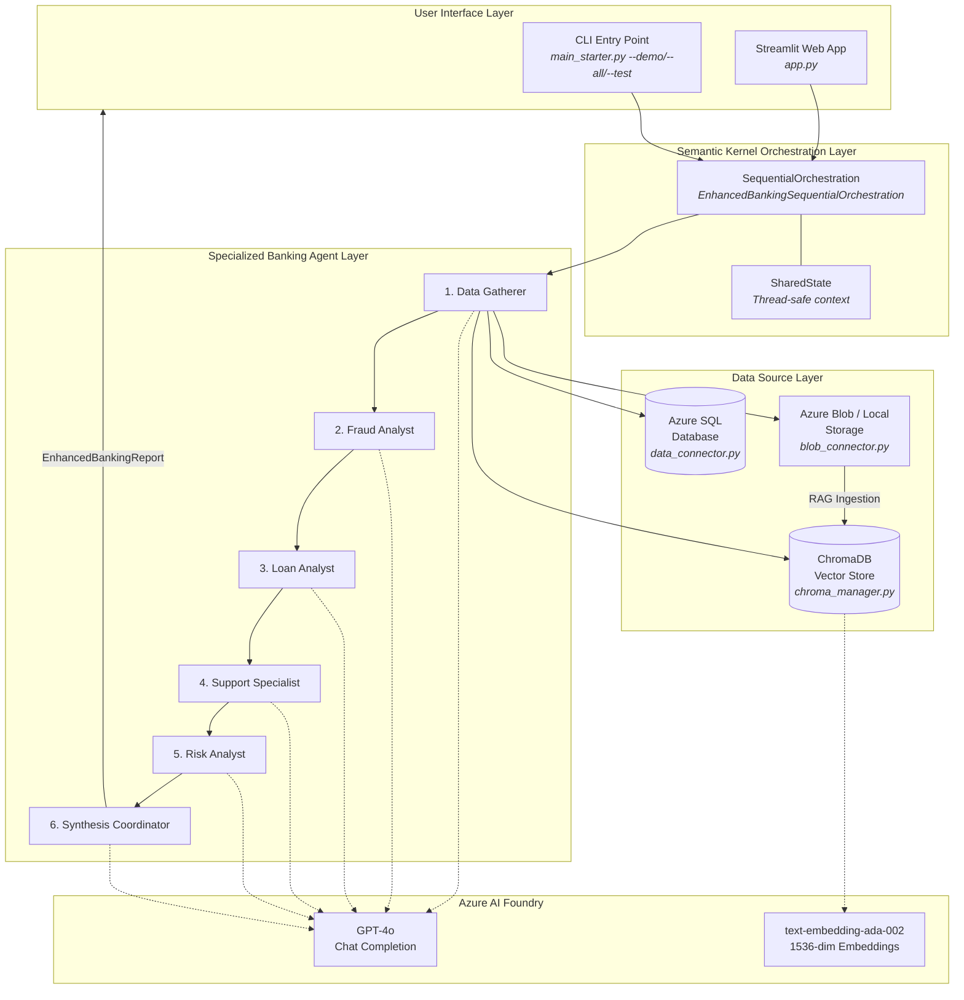
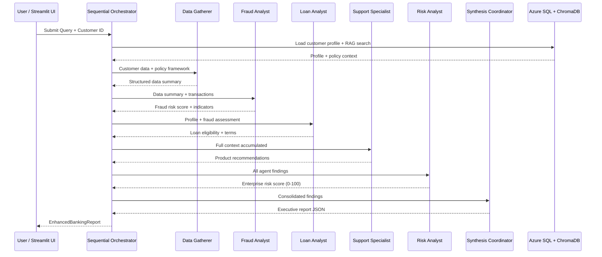
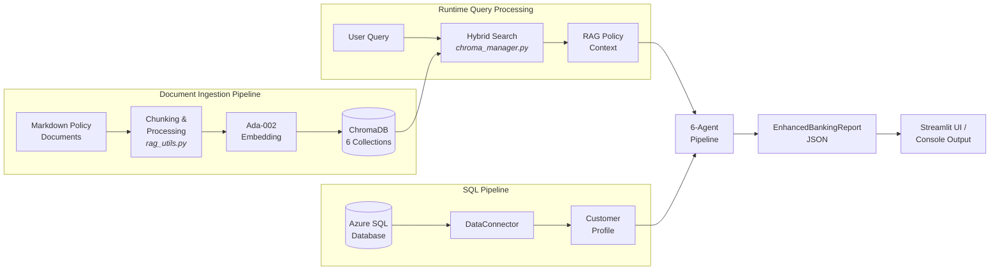

# AI Vectra Bank -- Banking Multi-Agent RAG System

Udacity "Microsoft Azure AI Foundry" Nanodegree -- Project 4

## Overview

A multi-agent banking intelligence system that orchestrates six specialised AI
agents using Microsoft Semantic Kernel to process complex banking queries. The
system uses sequential orchestration where each agent builds on the findings of
the previous one, producing a comprehensive banking analysis report.

## Architecture

### System Topology



### Agent Pipeline Sequence



### Data Flow



**Data Sources**:
- Azure SQL Database -- customer transactions and financial data
- ChromaDB -- banking policy vectors with Azure text-embedding-ada-002 (RAG)
- Azure Blob Storage / local files -- raw policy documents

> **Detailed architecture diagrams** (system topology, data flow, agent
> orchestration) are in [`docs/ARCHITECTURE.md`](docs/ARCHITECTURE.md).

## Streamlit UI

The project includes an interactive web dashboard built with Streamlit:

```bash
cd src
streamlit run app.py
```

**Features:**
- **Dashboard** -- Overview of agents, data sources, and customer profiles
- **Run Analysis** -- Submit queries to the full 6-agent pipeline interactively
- **Report Viewer** -- Browse and inspect all saved JSON reports
- **Architecture** -- Interactive Mermaid diagrams of the system

## Project Structure

```
Project_4/
  src/                        # Python source code
    app.py                    # Streamlit web UI
    main_starter.py           # CLI entry point and orchestration
    azure_embedding.py        # Azure OpenAI embedding function for ChromaDB
    blob_connector.py         # Document storage connector
    chroma_manager.py         # ChromaDB vector store manager
    rag_utils.py              # Document processing and RAG utilities
    shared_state.py           # Thread-safe state management
    data_connector.py         # Azure SQL Database connector
    models.py                 # Pydantic data models
  data/
    sql/                      # Database scripts
      create.sql              # Table schema
      insert.sql              # Sample transaction data
      query.sql               # Reference queries
  docs/                       # Documentation and screenshots
    ARCHITECTURE.md           # Architecture diagrams (Mermaid)
    PROJECT_STATUS_REVIEW.md  # Project progress tracking
    VERSIONS.md               # Branch and version tracking
  screenshots/                # Azure portal screenshots for submission
  session_memory/             # Session-by-session development logs
  Seed_code/                  # Original starter code (reference)
  reports/                    # Generated analysis reports (gitignored)
  logs/                       # Runtime logs (gitignored)
  .env                        # Credentials (gitignored -- never commit)
  env.example                 # Credential template (safe to commit)
  requirements.txt            # Python dependencies
  DEVELOPMENT_RULES.md        # Team development standards
  README.md                   # This file
```

## Prerequisites

- Python 3.12
- Azure subscription with:
  - Azure OpenAI Service (GPT-4 / GPT-4o + text-embedding-ada-002 deployed)
  - Azure SQL Database
  - Azure Blob Storage (optional -- local fallback included)
- ODBC Driver 18 for SQL Server

## Setup

```bash
# 1. Clone the repository
git clone https://github.com/rodolfolermacontreras/AI-Vectra-Bank-AI-Agentic-RAG-for-Banking.git
cd AI-Vectra-Bank-AI-Agentic-RAG-for-Banking

# 2. Create and activate virtual environment
py -3.12 -m venv .venv
.venv\Scripts\Activate.ps1          # Windows PowerShell
# source .venv/bin/activate         # macOS / Linux

# 3. Install dependencies
pip install -r requirements.txt

# 4. Configure credentials
cp env.example .env
# Edit .env with your Azure credentials

# 5. Provision Azure SQL and load data
# Run data/sql/create.sql then data/sql/insert.sql on your Azure SQL instance
```

## Usage

```bash
cd src

# Launch the Streamlit web UI
streamlit run app.py

# Or use the CLI:
python main_starter.py --test    # Component validation tests
python main_starter.py --demo    # Single demo scenario
python main_starter.py --all     # Full 5-scenario evaluation suite
```

## Tech Stack

| Component | Version |
|-----------|---------||
| Python | 3.12 |
| semantic-kernel | 1.37.0 |
| streamlit | 1.40+ |
| chromadb | 1.0.20 |
| openai | 1.x |
| azure-ai-inference | 1.x |
| python-docx | 1.2.0 |
| pyodbc | 5.2.0 |
| pydantic | 2.x |
| python-dotenv | 1.x |
| Azure OpenAI | GPT-4o, text-embedding-ada-002 |

## License

This project is part of the Udacity Microsoft Azure AI Foundry Nanodegree.
