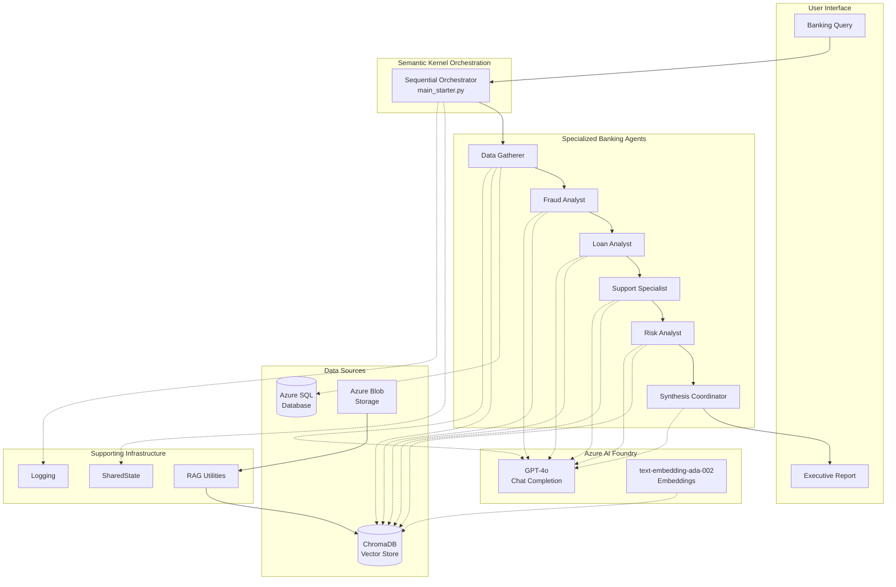
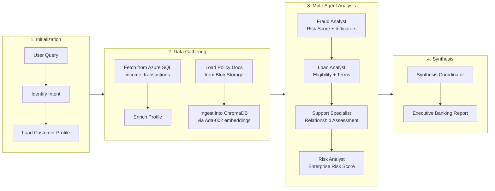
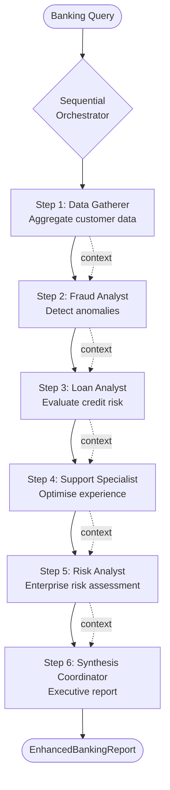

# Architecture Diagrams -- AI Vectra Bank

## 1. System Architecture -- Component Topology

---

## 2. Data Flow and RAG Pipeline

---

## 3. Agent Orchestration Logic

---

## Component Summary

| Component | File | Responsibility |
|-----------|------|----------------|
| Orchestrator | `main_starter.py` | Sequential agent invocation, report assembly |
| Data Gatherer | Agent 1 | Customer profiling, data aggregation |
| Fraud Analyst | Agent 2 | Transaction anomaly detection |
| Loan Analyst | Agent 3 | Credit risk and loan evaluation |
| Support Specialist | Agent 4 | Customer experience optimisation |
| Risk Analyst | Agent 5 | Enterprise risk and compliance |
| Synthesis Coordinator | Agent 6 | Executive report generation |
| DataConnector | `data_connector.py` | Azure SQL Database queries |
| ChromaDBManager | `chroma_manager.py` | Vector store for RAG retrieval |
| BlobStorageConnector | `blob_connector.py` | Document storage and management |
| AzureEmbeddingFunction | `azure_embedding.py` | Azure Ada-002 embeddings for ChromaDB |
| RAG Utilities | `rag_utils.py` | Policy extraction and context preparation |
| SharedState | `shared_state.py` | Thread-safe state management |
| Pydantic Models | `models.py` | Data validation and report structure |
